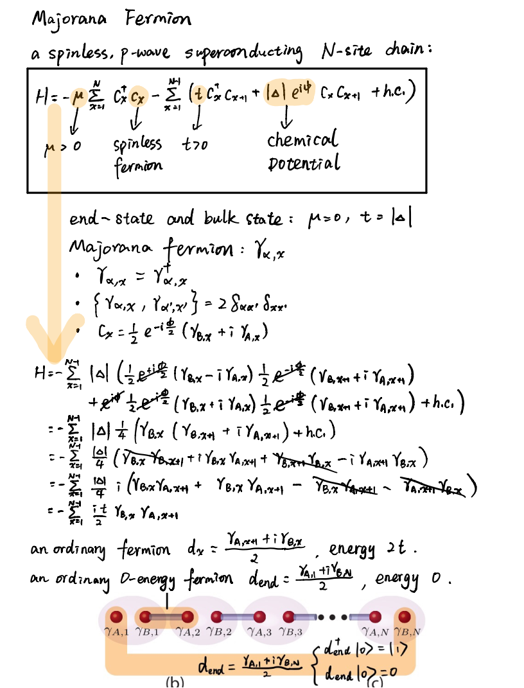
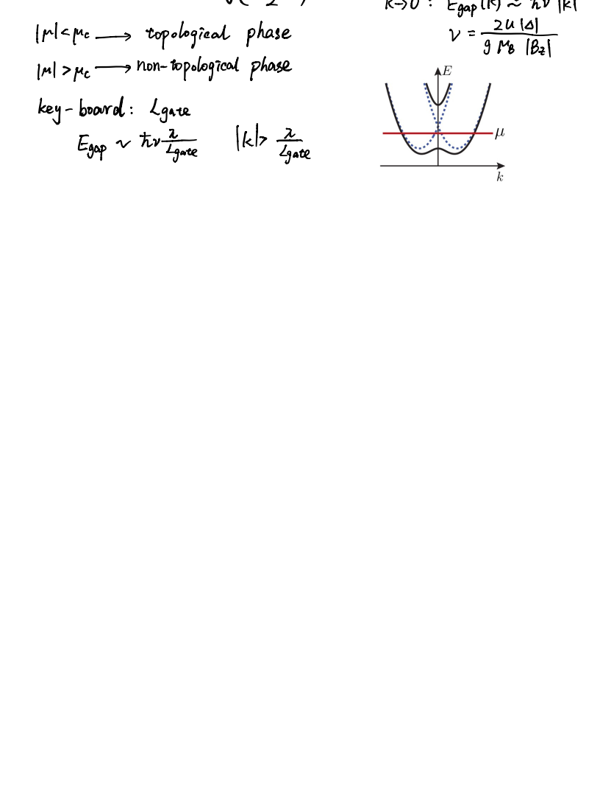

# Majorana Fermion

[1] Alicea J, Oreg Y, Refael G, et al. Non-Abelian statistics and topological quantum information processing in 1D wire networks[J]. Nature Physics, 2011, 7(5): 412.

[2] Bravyi S. Universal quantum computation with the ν= 5∕ 2 fractional quantum Hall state[J]. Physical Review A, 2006, 73(4): 042313.

[3] Iyer P. Topological quantum computation using Majorana Fermions[J].