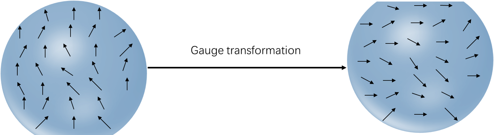

# Spinning quantum system in an external magnetic field

Key words: periodic rotation, exact solution, Aharonov-Anandan phase. 

Hamiltonian: 

$$
\newcommand{\Hilbert}[1]{\mathscr{#1}}
\newcommand{\dd}{\operatorname{d}}
\newcommand{\op}{\hat}
\newcommand{\id}{\mathbf{I}}
\newcommand{\Tr}[1]{\operatorname{Tr}\left\lbrace#1\right\rbrace}
\newcommand{\intset}{\mathbb Z }
\newcommand{\comset }{\mathbb C }
\newcommand{\innerproduct}[1]{\left\langle #1 \right\rangle}
\renewcommand{\vec}{\mathbf}
\newcommand{\spl}[1]{\langle{#1}\rangle}
\newcommand{\inner}[2]{\left\langle{#1,#2}\right\rangle}
\newcommand{\form}{\tilde}
\newcommand{\abs}[1]{\left\vert{#1}\right\vert}
\newcommand{\bra}[1]{\left\langle{#1}\right\vert }
\newcommand{\ket}[1]{\left| {#1}\right\rangle}
\newcommand{\braket}[2]{\left\langle {#1} \; \middle|\;{#2} \right\rangle }
\newcommand{\mani}{\mathcal}
\newcommand{\field}{\mathscr}
\newcommand{\Tspace}[1]{T\! {#1}}
\newcommand{\R}{\mathbb{R}}
\newcommand{\D}[2]{\frac{\d {#1}}{\d {#2} }}
\newcommand{\Partial}[2]{\frac{\partial {#1} }{\partial {#2} }}
\newcommand{\op}{\hat}
\newcommand{\uvec}{\hat}
\newcommand{\dfdas}{: =}
\newcommand{\Eqn}[1]{\text{(Eqn. }\ref{#1}\text{)}}
\newcommand{\dual}{\tilde}
\newcommand{\vard}{\mathfrak{d}}
\newcommand{\vare}{\mathfrak{e}}
\newcommand{\e}{\mathrm{e}}
\newcommand{\ii}{\mathrm{i}}
\newcommand{\blue}{\color{blue}}
\newcommand{\red}{\color{red}}
\newcommand{\norm}[1]{\left\|{#1}\right\|}
\newcommand{\set}[1]{\left\lbrace{#1}\right\rbrace}
\newcommand{\sgn}{\operatorname{sgn}}
\notag

h(\vec{R} (t)) = - \frac{B g e}{2 m c} \vec{R} (t) \cdot \op{\vec{J}} = b \vec{R} (t) \cdot \op{\vec{J}}
$$

with parameter $\vec{R} (t)$ and angular momentum operator $\op{\vec{J}}$. The parameter space is a unit sphere.

$$
\notag
\vec{R} = \left(\begin{matrix}
\sin \theta \cos \varphi\\
\sin \theta \sin \varphi\\
\cos \theta 
\end{matrix}\right)
$$

The path we adapt is to process around $z$ axis, that is, $\varphi = 2 \omega t$.

$$
\vec{R} (t) = \left(\begin{matrix}
\sin \theta \cos 2 \omega t\\
\sin \theta \sin 2 \omega t\\
\cos \theta 
\end{matrix}\right) =  \sin \theta \vec{e} _ {12} (t) + \cos \theta \vec{e} _ {3}
$$

where $ \vec{e} _ {12} (t)=\vec{e} _ 1 \cos 2 \omega t + \vec{e} _ 2 \sin 2 \omega t$. The Hamiltonian is

$$
\begin{align*}
h(t) & = b \vec{R} (t) \cdot \op{\vec{J}} \\
& = b ( \sin \theta \vec{e} _ {12} (t) + \cos \theta \vec{e} _ {3}) \cdot \op{\vec{J}}\\
& = b \sin \theta (J _ 1 \cos 2 \omega t + \op{J} _ 2 \sin 2 \omega t ) + b \cos \theta \op{J} _ 3\\
& = b \sin \theta \e ^{- \ii \omega t \op{J} _ 3 } \op{J} _ 1 \e ^{\ii \omega t \op{J} _ 3 } + b \cos \theta \op{J} _ 3 \\
& = \e ^{- \ii \omega t \op{J} _ 3 } (b \sin \theta \op{J} _ 1 + b \cos \theta \op{J} _ 3) \e ^{\ii \omega t \op{J} _ 3 }\\
& = \e ^{- \ii \omega t \op{J} _ 3 } h _ 0 \e ^{\ii \omega t \op{J} _ 3 }
\end{align*}
$$

with the initial Hamiltonian h _ 0 = b \sin \theta \op{J} p{J} _ 1 + b \cos \theta \op{J} _ 3. The Hamiltonian is periodic, $h (\frac{2\pi}{\omega})=h_0​$.

>Using the properties of  angular momentum operator, we prove the above transformation.
>
>- $\e ^{-\ii \omega t  \op{J}  _ 3}  \op{J}  _ 1 \e ^{\ii \omega t  \op{J}  _ 3} =   \op{J}  _ 1 \cos \omega t +  \op{J}  _ 2 \sin \omega t $ :
>
>$$
>\begin{align*}
>& \because \e ^A B \e ^{-A}=B+\sum _ {n=1} ^\infin \frac{B _ n}{n!}, \text{where } B _ 0 \dfdas B,\ B _ n \dfdas [A, B _ {n-1}] ;\ [J _ i, \op{J} _ j] = \ii \varepsilon _ {ijk} \op{J} _ k\\
>& \therefore \e ^{-\ii \omega t \op{J} _ 3} \op{J} _ 1 \e ^{\ii \omega t \op{J} _ 3} \\
>& = \op{J} _ 1 + \omega t \op{J} _ 2 - \frac{1}{2!} (\omega t)^2 \op{J} _ 1  + \frac{1}{3!}  (\omega t)^3 \op{J} _ 2 + \cdots \\ 
>& = \op{J} _ 1 (1 - \frac{1}{2!} (\omega t)^2 + \cdots) + \op{J} _ 2 (\omega t  + \frac{1}{3!}  (\omega t)^3 + \cdots) \\ 
>& = \op{J} _ 1 \cos \omega t + \op{J} _ 2 \sin \omega t \\
>\end{align*}
>$$
>
>- $ \e ^{-\ii \omega t  \op{J}  _ 3}  \op{J} _ 3 \e ^{\ii \omega t  \op{J}  _ 3} =  \op{J}  _ 3$ ;
>- Generally, $\e ^{-\ii a  \op{J} _ i}  \op{J}  _ j \e ^{\ii a  \op{J}  _ i} =   \op{J}  _ j (\delta _ {ij} + (1-\delta _ {ij}) \cos a) +  \op{J}  _ k \varepsilon _ {ijk} \sin a$.
>

The eigenvectors are (can't be proved?)

$$
h(R) \ket{k , R} = b \vec{R} (t) \cdot \op{\vec{J}} \ket{k , R} = b k \ket{k , R}
$$

where $k$ is the quantum number for the component of angular momentum along the changing direction of the external magnetic field, and $R$  refers to $\theta, \ \varphi$ . The eigenvalues $E _ k (R (t)) = b k$ are time-independent, while the eigenvectors and eigen projectors $ \Lambda _ k (R (t)) = \ket{k , R} \bra{k , R}$ are not.

There are 2 conditions:

- $H^{total}=H_0+h(t)$, where $H_0$ is the rotationally invariant part.
  - Hamiltonian commutes with $\op{\vec{J}} ^2$, so the state vectors $\ket{k, R}$ are also eigenvectors of $\op{\vec{J}} ^2$.

>$$
>\begin{align*}
>& \quad \ [h(t),\op{\vec{J}} ^2] \\
>& = [ b \vec{R} (t) \cdot \op{\vec{J}},\op{\vec{J}} ^2] \\
>& = b [R _ 1 \op{J} _ 1 + R _ 2 \op{J} _ 2 + R _ 3 \op{J} _ 3,\op{\vec{J}} ^2] \\
>& = b R _ 1 [\op{J} _ 1 ,\op{\vec{J}} ^2]+ b R _ 2 [\op{J} _ 2 ,\op{\vec{J}} ^2] + R _ 3 [\op{J} _ 3,\op{\vec{J}} ^2] \\
>& = 0\\
>& \quad \ [h(t),\op{J} _ 3] \\
>& = [ b \vec{R} (t) \cdot \op{\vec{J}},\op{J} _ 3] \\
>& = b [R _ 1 \op{J} _ 1 + R _ 2 \op{J} _ 2 + R _ 3 \op{J} _ 3,\op{J} _ 3] \\
>& = 2 \ii b (- R _ 1 \op{J} _ 2 + R _ 2 \op{J} _ 1 )\\
>& \ne 0
>\end{align*}
>$$
>

  - 
      - But Hamiltonian doesn't commute with $\op{J}_z$. So (why) the possible values of $k$ are

$$
k=-j,-j+1,...,j-1,j,\quad \text{where}\ j \in \frac{\Z}{2}
$$

- $H^{total} = \op{\vec{X}} \cdot \op{\vec{J}}+h(t)$, where $\op{\vec{X}} \cdot \op{\vec{J}}$ describes the slowly changing quantum environment for the electron, and $\op{\vec{X}}$ is the position operator of the internuclear axis of the molecule,  rotating in space.
  - Hamiltonian commutes with $\op{\vec{X}} \cdot \op{\vec{J}}$, instead of $\op{\vec{J}} ^2$.
  - The electronic angular momentum is not a good quantum number, because one does not have spherical symmetry but only axial symmetry about the internuclear axis $\op{\vec{X}}$.

>$$
>\begin{align*}
>& \quad \ [h(t),\op{\vec{X}} \cdot \op{\vec{J}}] \\
>& = [ b \vec{R} (t) \cdot \op{\vec{J}},\op{\vec{X}} \cdot \op{\vec{J}}] \\
>& = b [R _ 1 \op{J} _ 1 + R _ 2 \op{J} _ 2 + R _ 3 \op{J} _ 3 , \op{X} _ 1 \op{J} _ 1 + \op{X} _ 2 \op{J} _ 2 + \op{X} _ 3 \op{J} _ 3] \\
>& = b(R _ 1 \op{X} _ 2 - R _ 2 \op{X} _ 1)[\op{J} _ 1, \op{J} _ 2] +  b(R _ 2 \op{X} _ 3 - R _ 3 \op{X} _ 2)[\op{J} _ 2, \op{J} _ 3] + b(R _ 3 \op{X} _ 1 - R _ 1 \op{X} _ 3)[\op{J} _ 3, \op{J} _ 1] \\
>& \quad \ + b R _ 1 [\op{J} _ 1 , \op{X} _ 2] \op{J} _ 2 + b R _ 1 [\op{J} _ 1 , \op{X} _ 3] \op{J} _ 3 + b R _ 2 [\op{J} _ 2 , \op{X} _ 1] \op{J} _ 1 + b R _ 2 [\op{J} _ 2 , \op{X} _ 3] \op{J} _ 3 + b R _ 3 [\op{J} _ 3 , \op{X} _ 1] \op{J} _ 1 + b R _ 3 [\op{J} _ 3 , \op{X} _ 2] \op{J} _ 2\\
>& = \ii b (R _ 1 \op{X} _ 2 - R _ 2 \op{X} _ 1) \op{J} _ 3 + \ii b (R _ 2 \op{X} _ 3 - R _ 3 \op{X} _ 2) \op{J} _ 1 + \ii b (R _ 3 \op{X} _ 1 - R _ 1 \op{X} _ 3) \op{J} _ 2 \\
>& \quad \ + \ii b R _ 1 \op{X} _ 3 \op{J} _ 2 - \ii b R _ 1 \op{X} _ 2 \op{J} _ 3 - \ii b R _ 2 \op{X} _ 3 \op{J} _ 1 + \ii b R _ 2 \op{X} _ 1 \op{J} _ 3 + \ii b R _ 3 \op{X} _ 2 \op{J} _ 1 - \ii b R _ 3 \op{X} _ 1 \op{J} _ 2 \\
>& = 0\\
>& \quad \ [\op{\vec{X}} \cdot \op{\vec{J}},\op{\vec{J}} ^2] \\
>& = [\op{X} _ 1 \op{J} _ 1 + \op{X} _ 2 \op{J} _ 2 + \op{X} _ 3 \op{J} _ 3, \op{J} _ 1 ^2 + \op{J} _ 2 ^2 + \op{J} _ 3 ^2]\\
>& = [\op{X} _ 1,\op{J} _ 2 ^2] \op{J} _ 1 + [\op{X} _ 1,\op{J} _ 3 ^2] \op{J} _ 1 + [\op{X} _ 2,\op{J} _ 3 ^2] \op{J} _ 2 + [\op{X} _ 2,\op{J} _ 1 ^2] \op{J} _ 2 + [\op{X} _ 3,\op{J} _ 1 ^2] \op{J} _ 3 + [\op{X} _ 3,\op{J} _ 2 ^2] \op{J} _ 3 \\
>& = \ii \op{J} _ 2 \op{X} _ 3 \op{J} _ 1 + \ii \op{X} _ 3 \op{J} _ 2 \op{J} _ 1 - 
>\ii \op{J} _ 3 \op{X} _ 2 \op{J} _ 1 - \ii \op{X} _ 2 \op{J} _ 3 \op{J} _ 1 + 
>\ii \op{J} _ 3 \op{X} _ 1 \op{J} _ 2 + \ii \op{X} _ 1 \op{J} _ 3 \op{J} _ 2  \\
>& \quad - \ii \op{J} _ 1 \op{X} _ 3 \op{J} _ 2 - \ii \op{X} _ 3 \op{J} _ 1 \op{J} _ 2 + \ii \op{J} _ 1 \op{X} _ 2 \op{J} _ 3 + \ii \op{X} _ 2 \op{J} _ 1 \op{J} _ 3 - \ii \op{J} _ 2 \op{X} _ 1 \op{J} _ 3 - \ii \op{X} _ 1 \op{J} _ 2 \op{J} _ 3 + \\
>& =  \op{\vec{X}} \cdot \op{\vec{J}} - \op{\vec{J}} \cdot \op{\vec{X}}  \\
>& \ne 0
>\end{align*}
>$$
>

Applying ($\theta,\varphi$)-dependent rotations to an eigenvector $\ket{k , \vec{e}_3}$ gives unit vector along arbitrary direction.

The representations of rotation operation are 
$$
\begin{align*}
U _ 3 (\varphi) & = \e ^ {-\ii \varphi \op{J} _ 3} \dfdas \id + \frac{\varphi}{ \ii} \op{J} _ 3 + \frac{1}{2!} \left( \frac{\varphi}{ \ii} \op{J} _ 3 \right)^2 + \cdots \\
U _ 2 (\theta) & = \e ^ {-\ii \theta \op{J} _ 2} \dfdas \id + \frac{\theta}{\ii} \op{J} _ 2 + \frac{1}{2!} \left( \frac{\theta}{\ii} \op{J} _ 2 \right)^2 + \cdots\\
U ( \theta , \varphi) & = U _ 3 (\varphi) U _ 2 (\theta) U _ 3 (-\varphi)= \e ^ {-\ii \varphi \op{J} _ 3}  \e ^ {-\ii \theta \op{J} _ 2} \e ^ {\ii \varphi \op{J} _ 3}\\
\end{align*}
$$
$$
\begin{align*}
& \text{Hermition conjugate: }U ^\dagger (\theta , \varphi) = \e ^ {- \ii \varphi \op{J} _ 3}  \e ^ {\ii \theta \op{J} _ 2} \e ^ {\ii \varphi \op{J} _ 3}=U(- \theta , \varphi)\\
& \text{Unitary: } U ^\dagger (\theta , \varphi) U (\theta , \varphi) = \e ^ {- \ii \varphi \op{J} _ 3}  \e ^ {\ii \theta \op{J} _ 2} \e ^ {\ii \varphi \op{J} _ 3} \e ^ {-\ii \varphi \op{J} _ 3}  \e ^ {-\ii \theta \op{J} _ 2} \e ^ {\ii \varphi \op{J} _ 3} = \id
\end{align*}
$$

The normalized eigenvector $\ket{k,\vec{e} _ 3}$ of $\op{J} _ 3 = \vec{R} (0, 0) \cdot \vec{J}$ are transformed using the unitary operator $U (\theta, \varphi)$. The resulting vector is an eigenvector of the operator $\vec{R} (\theta , \varphi) \cdot \vec{J}$ with eigenvalue $k$.

$$
\ket{k,\theta, \varphi } \dfdas U ( \theta , \varphi) \ket{k,\vec{e} _ 3} = U _ 3 (\varphi) U _ 2 (\theta) U _ 3 (-\varphi) \ket{k,\vec{e} _ 3}\\
\vec{R} ( \theta , \varphi )\cdot \op{\vec{J}} \ket{k,\theta, \varphi } = k \ket{k,\theta, \varphi }
$$

For south pole $-\vec{e} _ 3$, the eigenvector $\ket{k,\pi, \varphi } = \e ^{-\ii \pi  \op{J}  _ 2} \e ^ {2 \ii \varphi k}  \ket{k,\vec{e} _ 3}$ has more than one normalized state vectors, obtained with varying $\varphi$. So there is a smooth single-valued vector function everywhere on $S^2$ except at the south pole.

>
>- When $i=2, j=3$ and $a = \pi$, the equation $\e ^{-\ii a J _ i} \op{J} _  j \e ^{\ii a \op{J} _ i} =  \op{J} _ j (\delta _ {ij} + (1-\delta _ {ij}) \cos 2 a) + \op{J} _ k \varepsilon _ {ijk} \sin 2 a$ becomes
>
>$$
>\begin{align*}
>\e ^{-\ii \pi \op{J} _ 2} \op{J} _ 3 \e ^{\ii \pi \op{J} _ 2} & =  \op{J} _ 3 \cos \pi + \op{J} _ 1 \sin \pi = - \op{J} _ 3\\
>\e ^{-\ii \pi \op{J} _ 2} \e ^{- \ii \varphi \op{J} _ 3} \e ^{\ii \pi \op{J} _ 2} & = \e ^{\ii \varphi \op{J} _ 3} \\
>\e ^{-\ii \pi \op{J} _ 2} \e ^{- \ii \varphi \op{J} _ 3}  & = \e ^{\ii \varphi \op{J} _ 3} \e ^{-\ii \pi \op{J} _ 2}\\
>\e ^{-\ii \pi \op{J} _ 2} & = \e ^{\ii \varphi \op{J} _ 3} \e ^{-\ii \pi \op{J} _ 2} \e ^{ \ii \varphi \op{J} _ 3}  \\
>\end{align*}
>$$
>
>- When $\theta=\pi$, the equation $\ket{k,\theta, \varphi } \dfdas U ( \theta , \varphi) \ket{k,\vec{e} _ 3} = U _ 3 (\varphi) U _ 2 (\theta) U _ 3 (-\varphi) \ket{k,\vec{e} _ 3}$ becomes
>
>$$
>\begin{align*}
>\ket{k,\pi, \varphi } & = U _ 3 (\varphi) U _ 2 (\pi) U _ 3 (-\varphi) \ket{k,\vec{e} _ 3}\\
>& = \e ^ {-\ii \varphi \op{J} _ 3} \e ^ {-\ii \pi \op{J} _ 2} \e ^ {\ii \varphi \op{J} _ 3} \ket{k,\vec{e} _ 3}\\
>& = \e ^ {-\ii \varphi \op{J} _ 3} \e ^{ \ii \varphi  \op{J}  _ 3} \e ^{-\ii \pi  \op{J}  _ 2} \e ^{\ii \varphi  \op{J}  _ 3} \e ^ {\ii \varphi \op{J} _ 3} \ket{k,\vec{e} _ 3}\\
>& =\e ^{-\ii \pi  \op{J}  _ 2} \e ^ {2 \ii \varphi \op{J} _ 3}  \ket{k,\vec{e} _ 3}\\
>& =\e ^{-\ii \pi  \op{J}  _ 2} \e ^ {2 \ii \varphi k}  \ket{k,\vec{e} _ 3}\\
>\end{align*}
>$$
>

Using a gauge transformation, the smooth single-valued vector function also can defined on $S^2$ except at the north pole. The gauge transformation is
$$
\ket{k,\theta, \varphi }' = \e ^ {- \ii 2 k \varphi} \ket{k,\theta, \varphi }\\
\text{North pole: }\ket{k,0, \varphi }' = \e ^ {- \ii 2 k \varphi} \ket{k, \vec{e} _ 3}\\
\text{South pole: }\ket{k,\pi, \varphi }' = \e ^ {- \ii 2 k \varphi} \ket{k,\pi, \varphi } = \e ^ {- \ii 2 k \varphi} \e ^{-\ii \pi  \op{J}  _ 2} \e ^ {2 \ii \varphi k}  \ket{k,\vec{e} _ 3} = \e ^{-\ii \pi  \op{J}  _ 2} \ket{k,\vec{e} _ 3}
$$

The projector operators and the corresponding subspaces of these two parameterization in the Hilbert space coincide:
$$
\ket{k,\theta, \varphi } \bra{k,\theta, \varphi } =\ket{k,\theta, \varphi } ' \bra{k,\theta, \varphi } '
$$

to-do list:

- [ ] prove $\vec{R} ( \theta , \varphi )\cdot \op{\vec{J}} \ket{k,\theta, \varphi } = k \ket{k,\theta, \varphi }$
- [ ] 

References

[1] Pascazio, S. "The geometric phase in quantum systems." (2003): 12345.