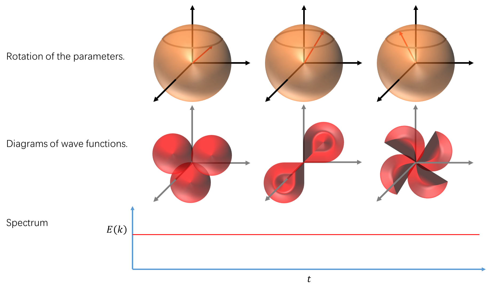

# Spinning quantum system in an external magnetic field

Key words: periodic rotation, exact solution, Aharonov-Anandan phase. 

Hamiltonian: 

$$
\newcommand{\Hilbert}[1]{\mathscr{#1}}
\newcommand{\dd}{\operatorname{d}}
\newcommand{\op}{\hat}
\newcommand{\id}{\mathbf{I}}
\newcommand{\Tr}[1]{\operatorname{Tr}\left\lbrace#1\right\rbrace}
\newcommand{\intset}{\mathbb Z }
\newcommand{\comset }{\mathbb C }
\newcommand{\innerproduct}[1]{\left\langle #1 \right\rangle}
\renewcommand{\vec}{\mathbf}
\newcommand{\spl}[1]{\langle{#1}\rangle}
\newcommand{\inner}[2]{\left\langle{#1,#2}\right\rangle}
\newcommand{\form}{\tilde}
\newcommand{\abs}[1]{\left\vert{#1}\right\vert}
\newcommand{\bra}[1]{\left\langle{#1}\right\vert }
\newcommand{\ket}[1]{\left| {#1}\right\rangle}
\newcommand{\braket}[2]{\left\langle {#1} \; \middle|\;{#2} \right\rangle }
\newcommand{\mani}{\mathcal}
\newcommand{\field}{\mathscr}
\newcommand{\Tspace}[1]{T\! {#1}}
\newcommand{\R}{\mathbb{R}}
\newcommand{\D}[2]{\frac{\d {#1}}{\d {#2} }}
\newcommand{\Partial}[2]{\frac{\partial {#1} }{\partial {#2} }}
\newcommand{\op}{\hat}
\newcommand{\uvec}{\hat}
\newcommand{\dfdas}{: =}
\newcommand{\Eqn}[1]{\text{(Eqn. }\ref{#1}\text{)}}
\newcommand{\dual}{\tilde}
\newcommand{\vard}{\mathfrak{d}}
\newcommand{\vare}{\mathfrak{e}}
\newcommand{\e}{\mathrm{e}}
\newcommand{\ii}{\mathrm{i}}
\newcommand{\blue}{\color{blue}}
\newcommand{\red}{\color{red}}
\newcommand{\norm}[1]{\left\|{#1}\right\|}
\newcommand{\set}[1]{\left\lbrace{#1}\right\rbrace}
\newcommand{\sgn}{\operatorname{sgn}}
\notag

h(\vec{R} (t)) = - \frac{B g e}{2 m c} \vec{R} (t) \cdot \op{\vec{J}} = b \vec{R} (t) \cdot \op{\vec{J}}
$$

with parameter $\vec{R} (t)$ and angular momentum operator $\op{\vec{J}}$. The parameter space is a unit sphere.

$$
\vec{R} = \left(\begin{matrix}
\sin \theta \cos \varphi\\
\sin \theta \sin \varphi\\
\cos \theta 
\end{matrix}\right)
$$

The path we adapt is to process around $z$ axis, that is, $\varphi = 2 \omega t$.
$$
\vec{R} (t) = \left(\begin{matrix}
\sin \theta \cos 2 \omega t\\
\sin \theta \sin 2 \omega t\\
\cos \theta 
\end{matrix}\right) =  \sin \theta \vec{e} _ {12} (t) + \cos \theta \vec{e} _ {3}
$$

where $ \vec{e} _ {12} (t)=\vec{e} _ 1 \cos 2 \omega t + \vec{e} _ 2 \sin 2 \omega t$. The Hamiltonian is
$$
\begin{align*}
h(t) & = b \vec{R} (t) \cdot \op{\vec{J}} \\
& = b ( \sin \theta \vec{e} _ {12} (t) + \cos \theta \vec{e} _ {3}) \cdot \op{\vec{J}}\\
& = b \sin \theta (J _ 1 \cos 2 \omega t + J _ 2 \sin 2 \omega t ) + b \cos \theta J _ 3\\
& = b \sin \theta \e ^{- \ii \omega t J _ 3 } J _ 1 \e ^{\ii \omega t J _ 3 } + b \cos \theta J _ 3 \\
& = \e ^{- \ii \omega t J _ 3 } (b \sin \theta J _ 1 + b \cos \theta J _ 3) \e ^{\ii \omega t J _ 3 }\\
& = \e ^{- \ii \omega t J _ 3 } h _ 0 \e ^{\ii \omega t J _ 3 }
\end{align*}
$$

with the initial Hamiltonian $h _ 0 = b \sin \theta J _ 1 + b \cos \theta J _ 3$. The Hamiltonian is periodic, $h (\frac{\pi}{\omega})=h_0$.

>Using the properties of  angular momentum operator, we prove the above transformation.
>
>- $\e ^{-\ii \omega t J _ 3} J _ 1 \e ^{\ii \omega t J _ 3} =  J _ 1 \sin 2 \omega t + J _ 2 \sin 2 \omega t $ :
>
>$$
>\begin{align*}
>& \because \e ^{\ii \omega t J _ 3} = I \cos \omega t + \ii J _ 3 \sin \omega t,\ [J _ a, J _ b]=2 \ii \varepsilon _ {abc} J _ c,\ \{J _ a, J _ b\}=2 \delta _ {ab} \id \\
>& \therefore \e ^{-\ii \omega t J _ 3} J _ 1 \e ^{\ii \omega t J _ 3} \\
>& = ( I \cos \omega t - \ii J _ 3 \sin \omega t ) J _ 1 ( I \cos \omega t + \ii J _ 3 \sin \omega t )\\
>& = J _ 1 \cos ^2 \omega t-\ii J _ 3 J _ 1 \sin \omega t \cos \omega t + \ii J _ 1 J _ 3 \cos \omega t \sin \omega t + J _ 3 J _ 1 J _ 3 \sin ^2 \omega t\\
>& = J _ 1 \cos ^2 \omega t-\ii [J _ 3, J _ 1] \sin \omega t \cos \omega t - J _ 1 J _ 3 J _ 3 \sin ^2 \omega t\\
>& = J _ 1 \cos ^2 \omega t+ 2 J _ 2 \sin \omega t \cos \omega t - J _ 1 \sin ^2 \omega t\\
>& = J _ 1 \sin 2 \omega t + J _ 2 \sin 2 \omega t \\
>\end{align*}
>$$
>
>- $ \e ^{-\ii \omega t J _ 3} J _ 3 \e ^{\ii \omega t J _ 3} = J _ 3$ :
>
>$$
>\begin{align*}
>& \because \e ^{\ii \omega t J _ 3} = I \cos \omega t + \ii J _ 3 \sin \omega t,\ [J _ a, J _ b]=2 \ii \varepsilon _ {abc} J _ c,\ \{J _ a, J _ b\}=2 \delta _ {ab} \id \\
>& \therefore \e ^{-\ii \omega t J _ 3} J _ 3 \e ^{\ii \omega t J _ 3} \\
>& = (I \cos \omega t - \ii J _ 3 \sin \omega t) J _ 3 (I \cos \omega t + \ii J _ 3 \sin \omega t)\\
>& = J _ 3 \cos ^2 \omega t-\ii J _ 3 J _ 3 \sin \omega t \cos \omega t + \ii J _ 3 J _ 3 \cos \omega t \sin \omega t + J _ 3 J _ 3 J _ 3 \sin ^2 \omega t\\
>& = J _ 3
>\end{align*}
>$$
>

The eigenvectors are (can't be proved?)
$$
h(R) \ket{k , R} = b \vec{R} (t) \cdot \op{\vec{J}} \ket{k , R} = b k \ket{k , R}
$$
where $k$ is the quantum number for the component of angular momentum along the changing direction of the external magnetic field, and $R$  refers to $\theta, \ \varphi$ . The eigenvalues $E _ k (R (t)) = b k$ are time-independent, while the eigenvectors and eigen projectors $ \Lambda _ k (R (t)) = \ket{k , R} \bra{k , R}$ are not.

 

References

[1] Pascazio, S. "The geometric phase in quantum systems." (2003): 12345.