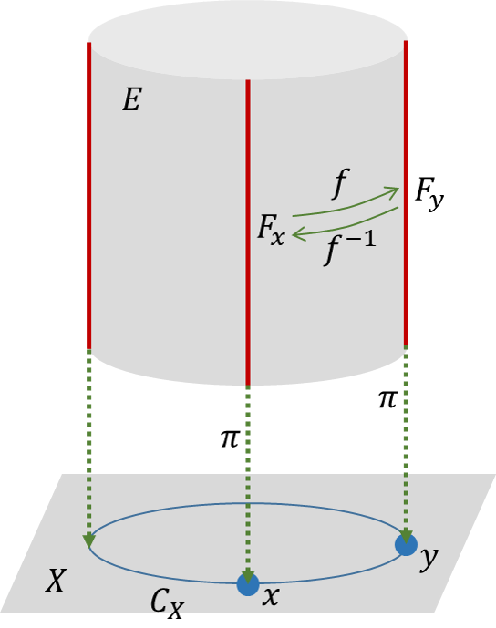
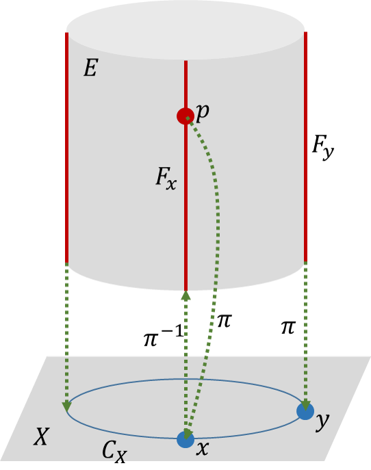
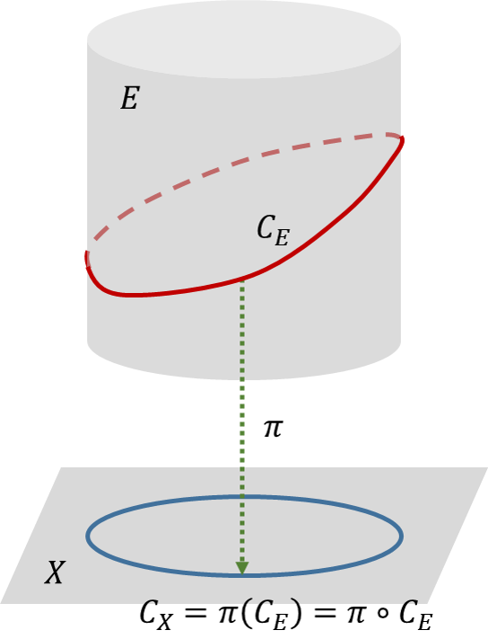
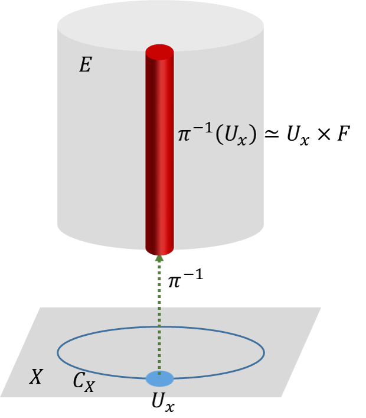

This note is following [The Geometric Phase in Quantum Systems: Foundations, Mathematical Concepts, and Applications in Molecular and Condensed Matter Physics](https://cds.cern.ch/record/737299/files/3540000313_TOC.pdf).

## From quantal phases to fiber bundles

### An elementary introduction to fiber bundles

---

Any fiber bundle consists of a base manifold $X$, a set of fibers and a total space $E$. All of the fibers are diffeomorphic copies of a smooth manifold $F$ of dimension $\mathcal{N}$ which is called the typical fiber. The integer $\mathcal{N}$ is called the fiber dimension or the rank of the bundle. Any point $p\in E$ projects on one of the fibers $F _ x$ through a projection map.

$$
\newcommand{\Hilbert}[1]{\mathscr{#1}}
\newcommand{\dd}{\operatorname{d}}
\newcommand{\op}{\hat}
\newcommand{\id}{\mathbf{I}}
\newcommand{\Tr}[1]{\operatorname{Tr}\left\lbrace#1\right\rbrace}
\newcommand{\realset}{\mathbb{R}}
\newcommand{\intset}{\mathbb Z }
\newcommand{\comset }{\mathbb C }
\newcommand{\innerproduct}[1]{\left\langle #1 \right\rangle}
\renewcommand{\vec}{\mathbf}
\newcommand{\spl}[1]{\langle{#1}\rangle}
\newcommand{\inner}[2]{\left\langle{#1,#2}\right\rangle}
\newcommand{\form}{\tilde}
\newcommand{\abs}[1]{\left\vert{#1}\right\vert}
\newcommand{\bra}[1]{\left\langle{#1}\right\vert }
\newcommand{\ket}[1]{\left| {#1}\right\rangle}
\newcommand{\braket}[2]{\left\langle {#1} \; \middle|\;{#2} \right\rangle }
\newcommand{\mani}{\mathcal}
\newcommand{\field}{\mathscr}
\newcommand{\Tspace}[1]{T\! {#1}}
\newcommand{\D}[2]{\frac{\d {#1}}{\d {#2} }}
\newcommand{\Partial}[2]{\frac{\partial {#1} }{\partial {#2} }}
\newcommand{\op}{\hat}
\newcommand{\uvec}{\hat}
\newcommand{\defas}{: =}
\newcommand{\isdefas}{= :}
\newcommand{\Eqn}[1]{\text{(Eqn. }\ref{#1}\text{)}}
\newcommand{\dual}{\tilde}
\newcommand{\vard}{\mathfrak{d}}
\newcommand{\vare}{\mathfrak{e}}
\newcommand{\e}{\mathrm{e}}
\newcommand{\ii}{\mathrm{i}}
\newcommand{\blue}{\color{blue}}
\newcommand{\red}{\color{red}}
\newcommand{\norm}[1]{\left\|{#1}\right\|}
\newcommand{\set}[1]{\left\lbrace{#1}\right\rbrace}
\newcommand{\sgn}{\operatorname{sgn}}
\newcommand\myeq{\stackrel{\mbox{adiabatic}}{=}}
\newcommand{\avg}[1]{\left\langle {#1} \right\rangle}
\newcommand{\myodot}[1]{\stackrel{#1}{\odot}}
\newcommand{\path}{\mathbf{C}}
\begin{align*}
& \pi : E \rightarrow X \\
& \pi (p) \defas x \text{  if and only if  } p \in F _ x
\end{align*}
$$

>Given two manifolds $M$ and $N$, a differentiable map $f : M → N$ is called a **diffeomorphism** if it is a bijection and its inverse $f ^ {−1} : N → M$ is differentiable as well. If these functions are $r$ times continuously differentiable, $f$ is called a $C _ r$-diffeomorphism.
>
>
>
>The fiber $F _ x$ over $x$ as the inverse image of $x$ under $\pi$, $F _ x = \pi ^ {-1} (x)$. 
>
>
>
>The projection map is an onto function, so that there are fibers over all the points of $X$.
>
>The projection map is a smooth (continuous) function. A smooth curve in $E$ projects to smooth curve in $X$.
>
>

The fiber bundle is locally the Cartesian product of an open subset of the base manifold $X$ and the typical fiber $F$. For any point $x \in X$, there is an open neighborhood $U _ x$ of $x$, such that
$$
\pi ^ {-1} (U _ x) \simeq U _ x \times F
$$

All the manifolds of the same finite dimension are locally identical, while the global structure distinguishes it from others of the same dimension. It depends on how to glue the open neighborhood to construct the manifold, which stored in transition or overlap functions. 

to-do list:

- [ ] 

References

[1] Bohm, Arno, et al. *The Geometric Phase in Quantum Systems: Foundations, Mathematical Concepts, and Applications in Molecular and Condensed Matter Physics*. Springer Science & Business Media, 2013.