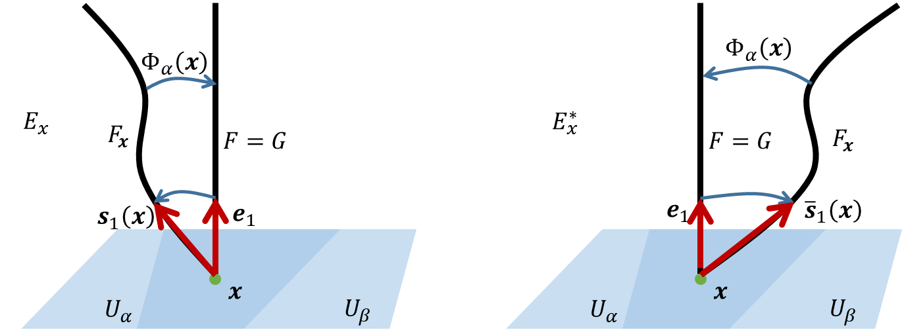

This note follows [The Geometric Phase in Quantum Systems: Foundations, Mathematical Concepts, and Applications in Molecular and Condensed Matter Physics](https://cds.cern.ch/record/737299/files/3540000313_TOC.pdf).

## Gauge theory of electromagnetism

We consider a non-relativistic (spinless) charged particle subject to an electromagnetic field in three-dimensional Euclidean space $\realset ^ 3$. In the position representation, the particle is described by a scalar wave function $\psi = \psi (\vec{x},t)$ where $\vec{x}\in \realset^3$. The dynamics of the wave function is determined by the Schrödinger equation,

$$
\newcommand{\Hilbert}[1]{\mathscr{#1}}
\newcommand{\dd}{\operatorname{d}}
\newcommand{\op}{\hat}
\newcommand{\id}{\mathbf{I}}
\newcommand{\Tr}[1]{\operatorname{Tr}\left\lbrace#1\right\rbrace}
\newcommand{\realset}{\mathbb{R}}
\newcommand{\intset}{\mathbb Z }
\newcommand{\comset }{\mathbb C }
\newcommand{\innerproduct}[1]{\left\langle #1 \right\rangle}
\renewcommand{\vec}{\mathbf}
\newcommand{\spl}[1]{\langle{#1}\rangle}
\newcommand{\inner}[2]{\left\langle{#1,#2}\right\rangle}
\newcommand{\form}{\tilde}
\newcommand{\abs}[1]{\left\vert{#1}\right\vert}
\newcommand{\bra}[1]{\left\langle{#1}\right\vert }
\newcommand{\ket}[1]{\left| {#1}\right\rangle}
\newcommand{\braket}[2]{\left\langle {#1} \; \middle|\;{#2} \right\rangle }
\newcommand{\mani}{\mathcal}
\newcommand{\field}{\mathscr}
\newcommand{\Tspace}[1]{T\! {#1}}
\newcommand{\D}[2]{\frac{\d {#1}}{\d {#2} }}
\newcommand{\Partial}[2]{\frac{\partial {#1} }{\partial {#2} }}
\newcommand{\op}{\hat}
\newcommand{\uvec}{\hat}
\newcommand{\defas}{: =}
\newcommand{\isdefas}{= :}
\newcommand{\Eqn}[1]{\text{(Eqn. }\ref{#1}\text{)}}
\newcommand{\dual}{\tilde}
\newcommand{\vard}{\mathfrak{d}}
\newcommand{\vare}{\mathfrak{e}}
\newcommand{\e}{\mathrm{e}}
\newcommand{\ii}{\mathrm{i}}
\newcommand{\blue}{\color{blue}}
\newcommand{\red}{\color{red}}
\newcommand{\norm}[1]{\left\|{#1}\right\|}
\newcommand{\set}[1]{\left\lbrace{#1}\right\rbrace}
\newcommand{\sgn}{\operatorname{sgn}}
\newcommand\myeq{\stackrel{\mbox{adiabatic}}{=}}
\newcommand{\avg}[1]{\left\langle {#1} \right\rangle}
\newcommand{\myodot}[1]{\stackrel{#1}{\odot}}
\newcommand{\path}{\mathbf{C}}
\begin{align*}
& \ii \frac{\partial \psi (\vec{x},t)}{\partial t}=H ^ {(el)}\psi(\vec{x},t)
\end{align*}
$$

Here $H ^ {(el)}$ is the Hamiltonian for the particle of the electric charge $e$, in an magnetic field

$$
\vec{E} ^ {(el)} = -\nabla A _ 0 ^ {(el)} - \frac{1}{c}\frac{\partial \vec{A} ^ {(el)}}{\partial t} , \vec{B} ^ {(el)} = \nabla \wedge \vec{A} ^ {(el)}
$$

It is given by 

$$
H ^ {(el)} = \frac{1}{2m} \left(\vec{p}-\frac{e\vec{A}^{(el)}}{c}\right)^2 + e A _ 0 ^ {(el)}
$$

The Hamiltonian contains, in place of the usual canonical momentum $\vec{p}$, the covariant momentum

$$
\pi \defas \vec{p} - \frac{e}{c}\vec{A}^{(el)}
$$

which fulfills the commutation relation

$$
[\pi _ a , \pi _ b]=\ii \frac{e}{c} \epsilon _ {abc}\left(B ^ {(el)}\right)^c
$$

The Schrödinger equation may also be written in the form

$$
(\ii\frac{\partial}{\partial t} - e A ^{(el)} _ 0) \psi = \frac{1}{2m} \left(\frac{1}{\ii}\nabla - \frac{e}{c} \vec{A}^{(el)}\right)^2 \psi
$$

As is well known, the electric field $\vec{E}^{(el)}$ and the magnetic field $\vec{B}^{(el)}$ are unaltered if the potentials are transformed in the following way

$$
\vec{A}^{(el)}\rightarrow\vec{A}^{\prime(el)}=\vec{A}^{(el)}+\nabla\alpha(\vec{x},t) \\
A _ 0 ^{(el)}\rightarrow A _ 0 ^{\prime(el)}=A _ 0 ^{(el)}-\frac{1}{c}\frac{\partial\alpha(\vec{x},t)}{\partial t} \\
$$

They can be viewed as a four-vector $(A ^ \mu)\defas (A ^ {(el)} _ 0, \vec{A}^{(el)})$ in the Minkowski space-time $M^4$ of special relativity. Alternatively they may be used to define a covariant vector field (a one-form),

$$
A ^ {(el)} =A ^ {(el)} _ \mu (x) \dd x ^ \mu
$$

where $x ^ 0 =ct$ and $A ^ {(el)} _ \mu (x)=\eta _ {\mu \nu}A ^ {(el)\nu} (x)$. The Minkowski metric is

$$
\eta = \text{diag}(1,-1,-1,-1)
$$

The transformations takes the form

$$
A ^ {(el)} \rightarrow A ^ {\prime(el)} = A ^ {(el)} - \dd \alpha
$$

where $\dd$ denotes the exterior derivative,

$$
\dd \alpha \defas \partial _ \mu \alpha \dd x ^ \mu = \frac{\partial \alpha}{\partial t} \dd t + \nabla \alpha \cdot \dd \vec{x}
$$

In order that the Schrodinger equation also remains unaltered, the wave function $\psi(\vec{x},t)$ has to undergo the phase transformation.

$$
\psi(\vec{x},t)\rightarrow \psi^\prime (\vec{x},t)=\e^{\ii\frac{e}{c}\alpha(\vec{x},t)}\psi(\vec{x},t)
$$

The combination of the two transformations is called a gauge transformation and the four-vector $(A ^ \mu)$ is called the gauge potential. 

>$$
>\begin{align*}
>& (\ii\frac{\partial}{\partial t} - e A ^{(el)} _ 0) \psi = \frac{1}{2m} \left(\frac{1}{\ii}\nabla - \frac{e}{c} \vec{A}^{(el)}\right)^2 \psi \\
>\text{LHS}& \rightarrow (\ii\frac{\partial}{\partial t} - e A ^{\prime(el)} _ 0) \psi ^ \prime \\
>& = \left(\ii\frac{\partial}{\partial t} - e \left( A ^{(el)} _ 0 - \frac{\partial \alpha}{\partial t} \dd t\right)\right) \e^{\ii\frac{e}{c}\alpha(\vec{x},t)}\psi \\
>& = \left(\ii\frac{\partial}{\partial t} - e A ^{(el)} _ 0 \right) \e^{\ii\frac{e}{c}\alpha(\vec{x},t)}\psi + e \frac{\partial \alpha}{\partial t} \dd t \e^{\ii\frac{e}{c}\alpha(\vec{x},t)}\psi \\
>& = \e^{\ii\frac{e}{c}\alpha(\vec{x},t)} \left(\ii\frac{\partial}{\partial t} - e A ^{(el)} _ 0 \right) \psi \\
>\text{RHS}& \rightarrow \frac{1}{2m} \left(\frac{1}{\ii}\nabla - \frac{e}{c} \vec{A}^{\prime(el)}\right)^2 \psi ^ \prime \\
>& = \frac{1}{2m} \left(\frac{1}{\ii}\nabla - \frac{e}{c}(\vec{A}^{(el)}-\nabla \alpha \cdot \dd \vec{x})\right)^2 \e^{\ii\frac{e}{c}\alpha(\vec{x},t)}\psi \\
>& = \frac{1}{2m} \left(\frac{1}{\ii}\nabla - \frac{e}{c}\vec{A}^{(el)} \right)^2 \e^{\ii\frac{e}{c}\alpha(\vec{x},t)}\psi \\
>& + \frac{1}{2m} \left(\left(\frac{e}{c} \nabla \alpha \cdot \dd \vec{x})\right)^2+ \left(\frac{1}{\ii}\nabla - \frac{e}{c}\vec{A}^{(el)} \right) \left(\frac{e}{c} \nabla \alpha \cdot \dd \vec{x})\right) + \left(\frac{e}{c} \nabla \alpha \cdot \dd \vec{x})\right) \left(\frac{1}{\ii}\nabla - \frac{e}{c}\vec{A}^{(el)} \right)\right) \e^{\ii\frac{e}{c}\alpha(\vec{x},t)}\psi \\
>& = \e^{\ii\frac{e}{c}\alpha(\vec{x},t)} \frac{1}{2m} \left(\frac{1}{\ii}\nabla - \frac{e}{c}\vec{A}^{(el)} \right)^2 \psi \\
>\end{align*}
>$$
>

If one defines in analogy to the covariant momentum the gauge covariant derivatives $\vec{D}$ and $D _ t$ by

$$
\frac{1}{\ii}\vec{D}=\frac{1}{\ii}\vec{D}(\vec{A}^ {(el)})\defas \frac{1}{\ii}\nabla-\frac{e}{c}\vec{A}^{(el)} \\
\ii D _ t=\frac{1}{\ii}D _ t(A _ 0^ {(el)})\defas \ii \frac{\partial}{\partial t}-e A _ 0^{(el)}
$$

then one can write the Schrodinger equation as 

$$
\ii D _ t \psi = \frac{-1}{2m} \vec{D} ^ 2 \psi
$$

The transformation can also be written in the terms of the covariant derivatives.
One may also define the covariant four-derivative $D (A^{(el)})$ with the components

$$
D _ \mu (A ^ {(el)}) \defas \partial _ \mu +\frac{\ii e}{c} A ^ {(el)} _ \mu \\
$$

where $D _ 0 = D _ t$. The transformation property is

$$
D _ \mu (A ^ {\prime (el)}) \e ^ {\ii \frac{e}{c} \alpha} \psi (\vec{x},t) = \e ^ {\ii \frac{e}{c} \alpha} D _ \mu (A ^ {(el)}) \psi (\vec{x},t) \\
D _ \mu (A ^ {\prime (el)}) \psi ^ \prime (\vec{x},t) = \e ^ {\ii \frac{e}{c} \alpha} D _ \mu (A ^ {(el)}) \psi (\vec{x},t) \\
D _ \mu (A ^ {\prime (el)}) = \e ^ {\ii \frac{e}{c} \alpha} D _ \mu (A ^ {(el)}) \e ^ {-\ii \frac{e}{c} \alpha}
$$

This equation indicates that the operators $D _ \mu$ transform covariantly under the gauge transformation, hence the name covariant derivative. They are directly linked to the electromagnetic field strengh $(\vec{E}^{(el)},\vec{B}^{(el)})$.

$$
[D _ \mu , D _ \nu] =\frac{\ii e}{c} (\partial _ \mu A _ \nu ^ {(el)} - \partial _ \nu A _ \mu ^ {(el)}) \isdefas \frac{\ii e}{c} F _ {\mu\nu} ^ {(el)} \\
F _ {0a} ^ {(el)} = (E^{(el)})^a,F _ {ab} ^ {(el)} =-\epsilon _ {abc} (B^{(el)})^c
$$

In order to generalize the above gauge theory we introduce the following notation

$$
\mathcal{U}(\alpha(\vec{x},t)) \defas \e ^ {\ii \frac{e}{c}\alpha(\vec{x},t)}
$$

Then the transformation is written as

$$
\begin{align*}
\psi(\vec{x},t) & \rightarrow\psi^\prime(\vec{x},t)=\mathcal{U}(\alpha(\vec{x},t)) \psi(\vec{x},t) \\
D _ \mu (A ^ {(el)}) \psi & \rightarrow D _ \mu (A ^ {\prime(el)}) \psi^\prime=\mathcal{U}(\alpha) (D _ \mu (A ^ {(el)}) \psi) \\
D _ \mu (A ^ {(el)}) & \rightarrow D _ \mu (A ^ {\prime(el)}) =\mathcal{U}(\alpha) (D _ \mu (A ^ {(el)}) \mathcal{U}^{-1}(\alpha)) \\
A ^ {(el)} & \rightarrow A ^ {\prime(el)}=\mathcal{U}(\alpha) A ^ {(el)} \mathcal{U}^{-1}(\alpha)-\frac{\ii c}{e}\mathcal{U}(\alpha) \dd \mathcal{U}^{-1}(\alpha)=A ^ {(el)} -\dd\alpha
\end{align*}
$$

>$$
>\begin{align*}
>A ^ {\prime(el)} & =\mathcal{U}(\alpha) A ^ {(el)} \mathcal{U}^{-1}(\alpha)-\frac{\ii c}{e}\mathcal{U}(\alpha) \dd \mathcal{U}^{-1}(\alpha)\\
>& =\e ^ {\ii \frac{e}{c}\alpha(\vec{x},t)} A ^ {(el)} \e ^ {-\ii \frac{e}{c}\alpha(\vec{x},t)}-\frac{\ii c}{e}\e ^ {\ii \frac{e}{c}\alpha(\vec{x},t)} \dd \e ^ {-\ii \frac{e}{c}\alpha(\vec{x},t)}\\
>& =A ^ {(el)}-\frac{\ii c}{e}\e ^ {\ii \frac{e}{c}\alpha(\vec{x},t)}  \e ^ {-\ii \frac{e}{c}\alpha(\vec{x},t)}(-\ii \frac{e}{c}\dd\alpha(\vec{x},t))\\
>& = A ^ {(el)} -\dd\alpha
>\end{align*}
>$$
>

A gauge transformation is associated with a function

$$
\mathcal{U}:M^4\rightarrow U(1)
$$

The set of all gauge transformations also form a Lie group. This is called the group of gauge transformation.

## General gauge theory

In general the ingredients of an abstract gauge theory are

- A parameter space $X$ which is in general a smooth manifold. 

- The gauge or symmetry group $G$ which locally defines all the gauge transformations. These transformations form an infinite-dimensional group called the group of gauge transformations. 
  
  $$
  A(x){\stackrel{g}{\rightarrow}}A ^ \prime (x)=g ^ {-1}(x)\cdot A (x)\cdot g (x)+\ii g ^ {-1}\cdot \dd g(x)
  $$
  
  Locally, it is an infinite direct product of copies of $G$ each of which is labeled by a parameter $x\in U _ \alpha$. Locally it is the product group $\times _ {x\in U _ \alpha} G _ x$.

- The matter fields which are represented by a collection $\psi = (\psi ^ n)$ of smooth functions $\psi ^ n : U _ \alpha \rightarrow \comset$ and which transform according to an $\mathcal{N}$-dimensional unitary representation
  
  $$
  \mathcal{U}:G\ni g \rightarrow \mathcal{U}(g)\in U (\mathcal{N})
  $$
  
  of the symmetry group $G$
  
  $$
  \psi(x)\rightarrow \psi ^ \prime (x)=\mathcal{U}(g(x))\psi(x)
  $$
  
  In terms of the components we have
  
  $$
  \psi ^ {\prime n} (x) = \sum ^ \mathcal{N} _ {\ell = 1} \mathcal{U} ^ {n\ell} (g(x)) \psi ^ \ell(x), n=1,\cdots\mathcal{N}.
  $$

- The gauge field or potential whose components $A _ i ^ {(g)}(x)=(A _ i ^ {nm}(x))$ that are $\mathcal{N}\times\mathcal{N}$ Hermitian matrices, with $\mathcal{N}$ being the dimension of the representation space, are postulated to transform under the transformation according to 
  
  $$
  A ^ {\prime (\mathrm{g})} _ i (x) = \mathcal{U}(g(x))\cdot A ^{(\mathrm{g})} _ i(x)\cdot \mathcal{U} ^ {-1} (g(x)) + \frac{\ii}{\mathrm{g}}[\partial _ i \mathcal{U}(g(x))\cdot\mathcal{U}^{-1}(g(x))]
  $$
  
  Furthermore under coordinate transformations of the parameter space $X$, $A^{(\mathrm{g})} _ i$ transform as components of a covariant vector. Hence they define a matrix-valued one-form
  
  $$
  A ^ {(\mathrm{g})} = A ^ {(\mathrm{g})} _ i (x) \dd x ^ i
  $$
  
  where the constant $\mathrm{g}$ with dimension of $\dim \mathrm{g} = (\dim x \cdot \dim A ^ {(\mathrm{g})})^{-1}$. 

With the gauge potential one defines the gauge-covariant derivatives:

$$
D _ i (A ^ {(g)}) \defas \partial _ i + \ii \mathrm{g} A ^ {(\mathrm{g})} _ i (x)
$$

The transformation property of the gauge-covariant derivative follows from the postulated transformation property of the $A ^ {(g)} _ i(x)$. It can be shown immediately that

$$
D _ i (A ^ {\prime(\mathrm{g})}) \defas \partial _ i + \ii \mathrm{g} A ^ {\prime(\mathrm{g})} _ i = \mathcal{U}(g(x))\cdot D _ i (A ^ {(\mathrm{g})}) \cdot \mathcal{U} ^ {-1}(g(x))
$$

and that

$$
D _ i (A ^ {\prime(\mathrm{g})}) \psi ^ \prime = \mathcal{U}(g(x))\cdot D _ i (A ^ {(\mathrm{g})}) \psi
$$

This means that the covariant derivatives $D _ i \psi$ of $\psi$ transform in the same way as $\psi$ does. 

>For the special case of an Abelian gauge theory for which $A ^ {(\mathrm{g})} _ i$ and $\mathcal{U}$ are $1\times 1$ matrices 
>
>$$
>A ^ {\prime (\mathrm{g})} (x) = A (\mathrm{g})(x) - \frac{1}{\mathrm{g}} \frac{e}{c} \dd \alpha (x)
>$$
>
>Electromagnetic gauge theory is therefore a special case of a general gauge theory with gauge group $U(1)$ and coupling constant $\frac{e}{c}$.

The non-Abelian gauge field tensor is defined as

$$
F _ {ij} ^ {(\mathrm{g})} \defas \frac{1}{\ii \mathrm{g}}[D _ i, D _ j]=\partial _ i A ^ {(g)} _ j - \partial _ j A _ i ^ {(\mathrm{g})} + \ii \mathrm{g}[A ^ {(\mathrm{g})} _ i, A ^ {(\mathrm{g})} _ j]
$$

The bracket mean the commutator of the $\mathcal{N}\times\mathcal{N}$ matrices with components

$$
[A ^ {(\mathrm{g})} _ i , A ^ {(\mathrm{g})} _ j]^{nm}\defas \sum ^ \mathcal{N} _ {l=1} (A ^ {n\ell} _ i A ^ {\ell m} _ j - A ^ {n\ell} _ j A ^ {\ell m} _ i)
$$

The transformed field strength tensor is

$$
F _ {ij} ^ {\prime(\mathrm{g})} = \mathcal{U} (g(x))\cdot F _ {ij} ^ {(\mathrm{g})}\cdot \mathcal{U}^{-1} (g(x))
$$

>$$
>\begin{align*}
>F _ {ij} ^ {\prime(\mathrm{g})} & = \frac{1}{\ii \mathrm{g}}[D _ i(A ^ {\prime (\mathrm{g})}), D _ j(A ^ {\prime (\mathrm{g})})]\\
>& = \frac{1}{\ii \mathrm{g}}[\mathcal{U}(g(x))\cdot D _ i (A ^ {(\mathrm{g})}) \cdot \mathcal{U} ^ {-1}(g(x)),\mathcal{U}(g(x))\cdot D _ j (A ^ {(\mathrm{g})}) \cdot \mathcal{U} ^ {-1}(g(x))]\\
>& = \frac{1}{\ii \mathrm{g}}(\mathcal{U}(g(x))\cdot D _ i (A ^ {(\mathrm{g})}) \cdot \mathcal{U} ^ {-1}(g(x))\mathcal{U}(g(x))\cdot D _ j (A ^ {(\mathrm{g})}) \cdot \mathcal{U} ^ {-1}(g(x))\\
>& \quad -\mathcal{U}(g(x))\cdot D _ j (A ^ {(\mathrm{g})}) \cdot \mathcal{U} ^ {-1}(g(x))\mathcal{U}(g(x))\cdot D _ i (A ^ {(\mathrm{g})}) \cdot \mathcal{U} ^ {-1}(g(x)))\\
>& =\mathcal{U} (g(x))\cdot \frac{1}{\ii \mathrm{g}}[D _ i(A ^ { (\mathrm{g})}), D _ j(A ^ { (\mathrm{g})})] \cdot \mathcal{U}^{-1} (g(x)) \\
>& =\mathcal{U} (g(x))\cdot F _ {ij} ^ {(\mathrm{g})}\cdot \mathcal{U}^{-1} (g(x))
>\end{align*}
>$$
>

This means that the field strength tensor of a non-Abelian gauge theory is gauge covariant, not gauge invariant. Therefore unlike in an Abelian gauge theory, the components $F ^ {nm} _ {ij}$ of the field strength of a non-Abelian gauge theory are not physical quantities. They may however be used to construct gauge-invariant quantities. 

There are other gauge-invariant quantities associated with gauge theory. These are called the Wilson loop integrals. They are defined for closed loops $C$ of the parameter manifold $X$ as the traces of the path-ordered exponentials, 

$$
\Tr{\mathcal{P}\e^{\ii\mathrm{g}\oint _ C A ^{(\mathrm{g})} _ i \dd x ^ \ii}}
$$

A gauge theory for which $F ^ {(\mathrm{g})} _ {ij}=0$ is called trivial. One can show that if

$$
A ^ {nm} _ i (x) = -\ii \sum _ \ell (\partial _ i \mathcal{V} ^ {\dagger n \ell}(x))\mathcal{V} ^ {\ell m}(x) = \ii \sum _ \ell \mathcal{V} ^ {\dagger n \ell} (x) (\partial _ i \mathcal{V} ^ {\ell m}(x))
$$

for some unitary matrix $\mathcal{V}(x)$, then the gauge theory is trivial. A gauge potential of this form is called a pure gauge. 

There are cases where a gauge theory is trivial but the gauge potential is not a pure gauge. Such theories are based on topologically non-trivial parameter spaces. They usually provide interesting information about the topological structure of the parameter space, like Aharonov-Bohm effect.

>Aharonov-Bohm effect 2.4
>
>

## Mathematical Foundations of gauge theories

Fiber bundles provide a most natural interpretation of gauge symmetry. In general, an abstract gauge theory is associated with a principal fiber bundle $(\mathcal{E},X,\pi,G)$ and its associated vector bundles $(E,X,\breve{\pi},\breve{G})$. The base space $X$ and the structure group $G$ provide the parameter space and the symmetry group of the gauge theory. The matter fields and the gauge potential are identified with the global sections and a local connection one-form of an associated vector bundle. Finally, the group of gauge transformations is the group consisting of all bundle isomorphisms $\mathcal{F}:\mathcal{E}\rightarrow\mathcal{E}$ of the PFB $\mathcal{E}$ which project to the identity map on $X$, $\pi(\mathcal{F}(\mathcal{E} _ x))=x$ and $\breve\pi(\breve{\mathcal{F}}(E _ x))=x$, for all $x\in X$.

## Geometry of vector bundles

A geometric structure on a vector bundle may be defined in terms of its associated PFB. There is also a closely related alternative approach in which one defines the notion of the parallel transportation of the vectors directly. A connection on a vector bundle $E$ is identified with a first-order differential operator

$$
\breve{D}:C ^ \infty (E) \rightarrow C ^ \infty (TX^*)\otimes C ^ \infty (E)
$$

In the following we shall concentrate on the case of $U(\mathcal{N})$ bundles, $(E,X,\breve{\pi},U(\mathcal{N}))$. Let us consider a global section

$$
\Psi : X \rightarrow E
$$

and a local trivialization $(U _ \alpha, \Phi _ \alpha)$ of $E$. Using $\Phi ^ {-1} _ \alpha(x)$ to map a complete orthonormal (unitary) basis $\set{e _ n}$ for $\comset^\mathcal{N}$ to $E _ x$, we can define the dual basis $\set{s ^ n (x)}$ and $\set{\bar{s} ^ n (x)}$. We can view them as column and row vectors belonging to $E _ x$ and its dual $E ^ * _ x$. We have

$$
\bar{s} ^ n (x) [ s _ m (x) ] = \bar{s} ^ n (x) \cdot s _ m (x) = \delta ^ n _ m \\
\sum ^ \mathcal{N} _ {n=1} s _ n (x) \cdot \bar{s} ^ n (x) = \id _ {\mathcal{N} \times \mathcal{N}}
$$

where $\delta ^ n _ m$ is the Kronecker delta function and $\id _ {\mathcal{N}\times\mathcal{N}}$ is the $\mathcal{N}\times\mathcal{N}$ unit matrix. 

The basis vectors $s _ n$ are indeed local sections,

$$
s _ n : U _ \alpha \rightarrow \breve{\pi} ^ {-1} (U _ \alpha)\subseteq E
$$

of $E$. The local basis sections defined using a given basis $\set{e _ n}$ of $\comset ^ \mathcal{N}$ is called a canonical basis. This is analogous to the canonical local sections of a PFB. For a global section $\Psi$ of $E$, we have

$$
\Psi(x)=\psi ^ n(x)s _ n (x), \quad \forall x \in U _ \alpha \\
\psi=\begin{pmatrix}
\psi ^ 1 \\
\psi ^ 2 \\
\cdots\\
\psi ^ \mathcal{N}
\end{pmatrix}
$$

where $\psi ^ n : U _ \alpha \rightarrow \comset$ are scalar functions. They are called the local components or fiber coordinates of $\Psi$ associated with the local basis $\set{s _ n}$. Next consider an alternative local basis,

$$
s _ n ^ \prime : U _ \beta \rightarrow \breve{\pi} ^ {-1} (U _ \beta) \subseteq E \\
\Psi(x)=\psi ^ {\prime n} (x)s _ n ^ \prime (x), \quad \forall x \in U _ \beta
$$

For every $x \in U _ \alpha \cap U _ \beta$, there exists a unitary matrix $\mathcal{U}(x)\in U (\mathcal{N})$ such that

$$
s _ n (x)\stackrel{\mathcal{U}(x)}{\rightarrow} s ^ \prime _ n (x) = \mathcal{U}(x)s _ n (x)
$$

Under this transformation the components transform according to 

$$
\psi ^ n (x) \stackrel{\mathcal{U}(x)}{\rightarrow} \psi ^ {\prime n} (x) = \sum ^ \mathcal{N} _ {m=1} (\mathcal{U} ^ {-1} (x))^{nm} \psi ^ m (x) \\
\psi(x)\stackrel{\mathcal{U}(x)}{\rightarrow} \psi ^ \prime (x) = \mathcal{U}^{-1}(x) \psi(x) \\
(\mathcal{U} ^ {-1} (x))^{nm} \defas \bar{s} ^ n (x) \cdot \mathcal{U}^{-1}(x)\cdot s _ m (x)
$$

>$$
>\begin{align*}
>s (x) \psi (x)& = s ^ \prime (x) \psi ^ {\prime}(x) \\
>s (x) \psi (x)& = \mathcal{U}(x) s (x) \psi ^ {\prime}(x) \\
>\psi (x) & = \mathcal{U}(x) \psi ^ {\prime}(x) \\
>\psi ^ {\prime} (x) & = \mathcal{U}^{-1}(x) \psi(x) \\
>\end{align*}
>$$
>

A connection on a vector bundle may be given by a first-order differential operator $\breve{D}$. In a local basis $\set{s _ n}$, we have

$$
\breve{D} \Psi (x) = (\breve{D} _ i \psi (x)) ^ n \dd x ^ i \otimes s _ n (x)
$$

where $\breve{D} _ i$ are the matrix-valued differential operators

$$
\breve{D} _ i \defas \partial _ i - \ii \breve{A} _ i (x)
$$

which act on the vector-valued function $\psi=\psi(x)$. They are used for defining parallel transportation. Under a coordinate transformation of the base manifold $X$, the global quantities such as $\Psi$ and $\breve{D}\Psi$ remain invariant. This implies that the entries $\breve{A} ^ {nm} _ i$ transform like the components of a one-form on $X$. Hence we can define the one-form $\breve{A} ^ {nm}=\breve{A} ^ {nm} _ i (x)\dd x ^ i$ and the matrix-valued one-form

$$
\breve{A} = \breve{A} _ i (x)\dd x ^ i
$$

Under a transformation of local bases, $\breve{D}\Phi$ is required to be independent of the choice of a local basis and we can easily show that $\breve{D} _ i$ and $\breve{A}$ must transform according to

$$
\begin{align*}
\breve{D} _ i & \stackrel{\mathcal{U}(x)}{\rightarrow} \breve{D} _ i ^ \prime = \mathcal{U}^{-1}(x) \breve{D} _ i \mathcal{U}(x) \\
\breve{A} & \stackrel{\mathcal{U}(x)}{\rightarrow} \breve{A} ^ \prime = \mathcal{U}^{-1}(x) \breve{A} \mathcal{U}(x) + \ii \mathcal{U}^{-1}(x) \cdot \dd\mathcal{U}(x)
\end{align*}
$$

where $\dd$ denotes the exterior derivative

$$
\dd \mathcal{U}(x)\defas \partial _ i \mathcal{U}(x)\dd x ^ i
$$

### Parallel transport

The parallel transport of a vector $\Psi _ 0\in E _ {x _ 0}$, along a curve $C _ X: [0,T]\rightarrow X$, with $x _ 0 \defas C _ X(t=0)$, is defined to be the end point of the horizontal lift $C _ E: [0,T]\rightarrow E$ of $C _ X$ which is defined as the solution of the differential equation

$$
\frac{\breve{D}}{D t} \Psi(x(t))=0 \text{, with } \Psi(t=0)=\Psi _ 0
$$

where $\Psi(x(t))\isdefas C _ E (t)$ and $\frac{\breve{D}}{D t}$ is locally expressed by

$$
\frac{\breve{D}}{D t} \psi(x(t))\defas\frac{\dd x ^ i (t)}{\dd t}\breve{D} _ i\psi(x(t)) ,\quad \forall C _ X (t)\in U _ \alpha
$$

The horizontal lift $C _ E$ is independent of the choice of a local basis.

>$$
>\begin{align*}
>\frac{\breve{D} }{D t} \Psi (x(t))= 0 \\
>\frac{\breve{D}}{D t} \left(s (x(t)) \psi(x(t)) \right)= 0 \\
>\frac{\breve{D}}{D t} s (x(t)) \psi(x(t)) + s (x(t)) \frac{\breve{D}}{D t} \psi(x(t)) = 0\\
>\frac{\dd x ^ i (t)}{\dd t}\breve{D} _ i s (x(t)) \psi(x(t)) + s (x(t)) \frac{\dd x ^ i (t)}{\dd t}\breve{D} _ i \psi(x(t)) = 0\\
>\frac{\dd x ^ i (t)}{\dd t} \mathcal{U}^{-1}(x) \breve{D} _ i \mathcal{U}(x) \mathcal{U}(x)s _ n (x) \mathcal{U}^{-1}(x) \psi(x) + \mathcal{U}(x)s _ n (x) \frac{\dd x ^ i (t)}{\dd t} \mathcal{U}^{-1}(x) \breve{D} _ i \mathcal{U}(x) \mathcal{U}^{-1}(x) \psi(x) = 0\\
>\frac{\dd x ^ i (t)}{\dd t}\breve{D} _ i ^ \prime s ^ \prime (x(t)) \psi ^ \prime (x(t)) + s ^ \prime (x(t)) \frac{\dd x ^ i (t)}{\dd t}\breve{D} _ i ^ \prime \psi ^ \prime (x(t)) = 0 \\
>\frac{\breve{D} ^ \prime}{D t} \left(s ^ \prime (x(t)) \psi ^ \prime (x(t)) \right)= 0 \\
>\frac{\breve{D} ^ \prime}{D t} \Psi ^ \prime (x(t))= 0
>\end{align*}
>$$
>

### The association of vector bundles with PFBs

|                 |                        Vector bundle                         |                  PFB                  |
| :-------------: | :----------------------------------------------------------: | :-----------------------------------: |
|      Space      |                             $E$                              |             $\mathcal{E}$             |
|   Base space    |                             $X$                              |                  $X$                  |
|   Projection    |                         $\breve\pi$                          |                 $\pi$                 |
| Structure Group | $\breve G\defas\rho(G),\breve G _ {\alpha\beta}\defas\rho(G_ {\alpha\beta})\in GL(V)$ |                  $G$                  |
|  Typical fiber  |                             $V$                              | $\breve{G},\breve{G} _ {\alpha\beta}$ |

>#### Differentiable Manifolds
>
>Let $M$ be a topological space with a countable basis. $M$ is said to be a topological manifold of dimension $m$, if there exists an open covering $\set{O _ \alpha}$ of $M$ such that each $O _ \alpha$ is homeomorphic to $\realset^m$. The homeomorphisms
>$$
>\phi _ \alpha : O _ \alpha \rightarrow \phi _ \alpha (O _ \alpha) \subseteq \realset ^ m 
>$$
>together with the open subset $O _ \alpha$ are called the charts of the manifold. A complete collection of charts is called as atlas. For every pair of interesting charts, $O _ \alpha \cap O _ \beta \ne \varnothing$, the function
>$$
>g _ {\alpha\beta} \defas \left. \phi _ \alpha \circ \phi _ \beta ^ {-1} \right\vert _ {O _ \alpha \cap O _ \beta} : \phi _ \beta (O _ \alpha \cap O _ \beta) \rightarrow \phi _ \alpha (O _ \alpha \cap O _ \beta)
>$$
>are homeomorphisms between open subsets of $\realset^m$. These functions are called the transition or overlap functions.
>
>##### Differentiable and smooth function
>
>Let $U\subseteq \realset^{m _ 1}$ and $V\subseteq \realset^{m _ 2}$. Then, a function $g:U\rightarrow V$ is said to be a $C ^ N$, $0<N\le\infty$, function if $g$ is $N$-times differentiable. A $C ^ \infty$ function is also called a **smooth** function. 
>
>$g$ is called a **diffeomorphism** if it is a differentiable homeomorphism with a differentiable inverse. 
>
>One defines **$C ^ N$ diffeomorphisms** by requiring a diffeomorphism and its inverse to be $C ^ N$.
>
>If the transition functions $g _ {\alpha\beta}$ are $C^N$ diffeomorphisms, then the manifold is called a **$C^N$ manifold**.
>
>In particular, $C ^ 1$ and $C ^ \infty$ manifolds are called **differentiable** and **smooth manifolds**, respectively.
>
> 
>
>

## References

[1] Bohm, Arno, et al. *The Geometric Phase in Quantum Systems: Foundations, Mathematical Concepts, and Applications in Molecular and Condensed Matter Physics*. Springer Science & Business Media, 2013.